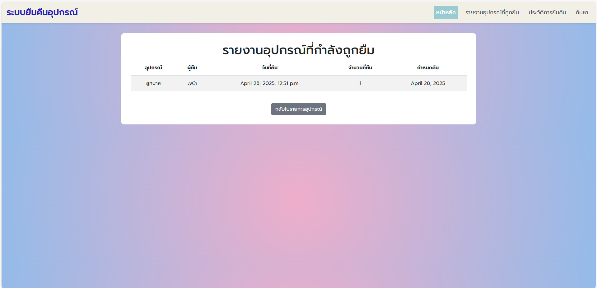
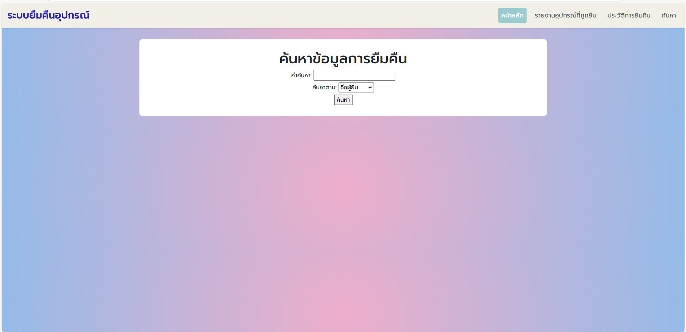

# ICT-PROJECT-12367
# ระบบยืมของสำนักคลัง

✨ ระบบยืมของสำนักคลังถูกพัฒนาขึ้นเพื่อจัดการอุปกรณ์ของสำนักคลังอย่างมีประสิทธิภาพ โดยมีจุดประสงค์หลักดังนี้:
* **การจัดการอุปกรณ์อย่างเป็นระบบ:** จัดระเบียบข้อมูลอุปกรณ์ทั้งหมดให้ชัดเจน ติดตามสถานะการใช้งาน และทำให้ค้นหาได้ง่าย
* **เพิ่มประสิทธิภาพในการดำเนินงาน:** ลดขั้นตอนที่ยุ่งยาก ลดเวลาในการทำงาน และมีการแจ้งเตือนอัตโนมัติเพื่อความรวดเร็ว
* **ลดความผิดพลาดและการสูญหาย:** ช่วยให้ข้อมูลถูกต้อง แม่นยำ ลดโอกาสที่อุปกรณ์จะหาย และสามารถตรวจสอบประวัติการใช้งานได้
* **สร้างความสะดวกให้กับผู้ใช้งาน:** ทำให้กระบวนการยืมคืนง่าย รวดเร็ว ตรวจสอบสถานะได้ และเข้าถึงข้อมูลได้สะดวก
* **การวิเคราะห์และรายงาน:** สามารถนำข้อมูลการใช้งานมาวิเคราะห์เพื่อวางแผนการจัดการอุปกรณ์ในอนาคต และสร้างรายงานต่างๆ ได้
## ✨ ฟีเจอร์หลัก
* **การยืมอุปกรณ์:** ผู้ใช้งานสามารถทำการยืมอุปกรณ์ที่มีในระบบได้
* **ดูประวัติการยืม:** ผู้ใช้งานสามารถตรวจสอบประวัติการยืมอุปกรณ์ของตนเอง
* **ค้นหาอุปกรณ์:** ผู้ใช้งานสามารถค้นหาอุปกรณ์ที่ต้องการยืมด้วยชื่อ
* **การคืนอุปกรณ์:** ผู้ใช้งานสามารถทำการคืนอุปกรณ์ที่ยืมไปแล้ว
* **การจัดการอุปกรณ์ (สำหรับผู้ดูแลระบบ):** เพิ่ม แก้ไข ลบ ข้อมูลอุปกรณ์
* **การจัดการผู้ใช้งาน (สำหรับผู้ดูแลระบบ):** เพิ่ม แก้ไข ลบ ข้อมูลผู้ใช้งาน
* **การแจ้งเตือน (อัตโนมัติ):** ระบบมีการแจ้งเตือนเมื่อถึงกำหนดคืนอุปกรณ์ 
* **รายงาน:** ระบบสามารถสร้างรายงานการใช้งานอุปกรณ์ต่างๆ
## ✨ วิธีการติดตั้ง
1.  **Prerequisites:** ตรวจสอบให้แน่ใจว่าคุณได้ติดตั้งสิ่งต่อไปนี้แล้ว:
    * [Python 3.x](https://www.python.org/downloads/)
    * [pip (Python package installer)](https://pip.pypa.io/en/stable/installing/)
    * [Git](https://git-scm.com/downloads)
2.  **Clone Repository:** 📁
    ```bash
    git clone [https://github.com/ชื่อผู้ใช้ของคุณ/ชื่อ Repository ของคุณ.git](https://github.com/ชื่อผู้ใช้ของคุณ/ชื่อ Repository ของคุณ.git)
    cd [ชื่อ Repository ของคุณ]
    ```
3.  **สร้าง Virtual Environment:** 📁
    ```bash
    python -m venv venv
    source venv/bin/activate  # บน macOS/Linux
    venv\Scripts\activate  # บน Windows
    ```
4.  **ติดตั้ง Dependencies:** 📁
    ```bash
    pip install -r requirements.txt
    ```
    (ตรวจสอบให้แน่ใจว่าคุณได้สร้างไฟล์ `requirements.txt` ที่ระบุ dependencies ของโปรเจกต์ Django ของคุณแล้ว เช่น `django`, `django-bootstrap4`)
5.  **ตั้งค่า Database:** 📁
    * แก้ไขการตั้งค่าฐานข้อมูลในไฟล์ `settings.py` ของ Django
    * สร้างฐานข้อมูล (ถ้าจำเป็น เช่น สร้าง database ใน PostgreSQL หรือ MySQL)
6.  **ทำการ Migrations:** 📁
    ```bash
    python manage.py migrate
    ```
    คำสั่งนี้จะสร้างตารางในฐานข้อมูลตามโมเดล Django ของคุณ
7.  **สร้าง Superuser (สำหรับผู้ดูแลระบบ):** 📁
    ```bash
    python manage.py createsuperuser
    ```
    ทำตามคำแนะนำเพื่อสร้างบัญชีผู้ดูแลระบบ
## วิธีการใช้งาน
1.  **รัน Development Server:** 📁
    ```bash
    python manage.py runserver
    ```
2.  **เข้าชม Application:** เปิดเบราว์เซอร์ของคุณและไปที่ `http://127.0.0.1:8000/` 📁
3.  **การเข้าสู่ระบบ:**
    * ผู้ใช้งานทั่วไปอาจมีการเข้าสู่ระบบด้วยบัญชีของสำนักคลัง (หากมีการเชื่อมต่อกับระบบอื่น) หรือบัญชีที่สร้างขึ้นในระบบ
    * ผู้ดูแลระบบสามารถเข้าสู่ระบบด้วยบัญชี superuser ที่สร้างไว้
4.  **การใช้งานฟีเจอร์หลัก:** 📁
    * **การยืมอุปกรณ์:** ไปที่หน้าสำหรับยืมอุปกรณ์ เลือกอุปกรณ์ที่ต้องการ และระบุวันที่ต้องการยืม
    * **ดูประวัติการยืม:** ไปที่หน้าประวัติการยืมเพื่อตรวจสอบรายการอุปกรณ์ที่เคยยืมและสถานะ
    * **ค้นหาอุปกรณ์:** ใช้ช่องค้นหาบนหน้าอุปกรณ์เพื่อค้นหาด้วยชื่ออุปกรณ์
    * **การคืนอุปกรณ์:** ไปที่หน้าสำหรับคืนอุปกรณ์ และระบุอุปกรณ์ที่ต้องการคืน
    **(สำหรับผู้ดูแลระบบ):** 📁
    * เข้าสู่ระบบด้วยบัญชี superuser และเข้าถึงส่วนการจัดการ (มักจะอยู่ที่ `/admin/`) เพื่อจัดการอุปกรณ์ ผู้ใช้งาน และการตั้งค่าอื่น ๆ
## 🛠️ เทคโนโลยีที่ใช้
* [Python](https://www.python.org/)
* [Django](https://www.djangoproject.com/) - The web framework used for this system.
* [Django Bootstrap 4](https://django-bootstrap4.readthedocs.io/en/stable/) - Used for responsive and stylish user interface.
* [ฐานข้อมูลที่ใช้] - (ระบุฐานข้อมูลที่คุณใช้ เช่น SQLite (default), PostgreSQL, MySQL)
## 🖥️ ภาพหน้าจอ 

*หน้าแรกของระบบแสดงรายการอุปกรณ์ที่สามารถยืมได้*

*หน้าประวัติการยืมแสดงรายการอุปกรณ์ที่ผู้ใช้เคยยืมและสถานะ*

*หน้าค้นหาอุปกรณ์ให้ผู้ใช้สามารถค้นหาอุปกรณ์ด้วยชื่อ*
## การมีส่วนร่วม
หากคุณต้องการมีส่วนร่วมในการพัฒนาโปรเจกต์นี้ สามารถทำได้โดย:
1.  Fork repository นี้
2.  สร้าง Branch ใหม่ (`git checkout -b feature/your-feature`)
3.  Commit การเปลี่ยนแปลงของคุณ (`git commit -m 'Add some your-feature'`)
4.  Push ไปยัง Branch (`git push origin feature/your-feature`)
5.  สร้าง Pull Request
## ผู้พัฒนา
* [ชัชนันท์ มหาภาพ]
* [พรประภา สมจันทร์]
👨‍💻 ผู้พัฒนา
ชื่อผู้พัฒนา - Chatchanan Mahapab 
📄 ลิขสิทธิ์
© 2023 - 2025 ระบบยืมอุปกรณ์สำนักคลัง - พัฒนาโดย ชัชนันท์ มหาภาพ
